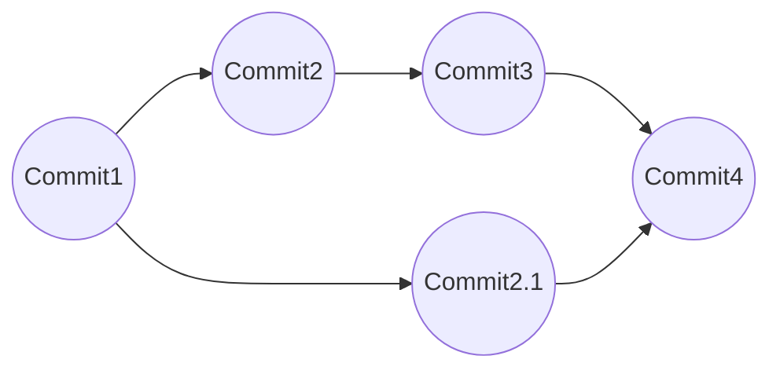

> This article is about the need for having `git-lfs`. For a primer on how to use `git` - there are tons of great articles available over internet, like [this](https://phoenixnap.com/kb/how-git-works).

`git` is awesome for managing plain text code files. There are numerous workflows with `git` - not even with just programming or code development, but for various other fields where version tracking is important. For example, this blog is managed in `git` itself!

### Why need `git-lfs` ?

While `git` works great for plain text version tracking (thanks to line by line file diff), it won't be so great for binary files. The prime reason being - git tracks every change ever made to a file! That means, if you are modifying a text file a 1,000 times (and committing changes, of course) then git will have some internal mechanism (the git magic) to re-produce the same exact version related to every commit!

Take away here is - git maintains a history of all the files and all their versions. For plain text files, this is fine since git will only store line by line changes between two commits. It maintains a linked list of these commits.

Above diagram shows a simple git workflow - if you are at Commit4, git knows how to reach either Commit2 or Commit2.1 based on line by line difference between all the (tracked and) committed files.

Key thing in this workflow is line by line diff - this was git only saves the changes between two versions of files and not the whole file itself. **git can do this for plain text files but cannot do this for binary files.** This means if git is tracking, say a screenshot. The screenshot is annotated and committed to git. If another change is made to the same screenshot, git will save the whole file again - this is different from the standard behaviour for which git is designed. This causes git history to become bloated with multiple versions of the same (whole) file. This is where `git-lfs` comes in.
`git-lfs` replaces the binary file with a pointer file that git will track.

**`git-lfs` provides a seamless replacement between pointer files and real binary files.**

>This idea is not unique to `git-lfs` though. Another popular tool `dvc` also uses similar concept - the transition to real binary files are more explicit in this tool. For more, see `dvc` [documentation](https://dvc.org/doc).
